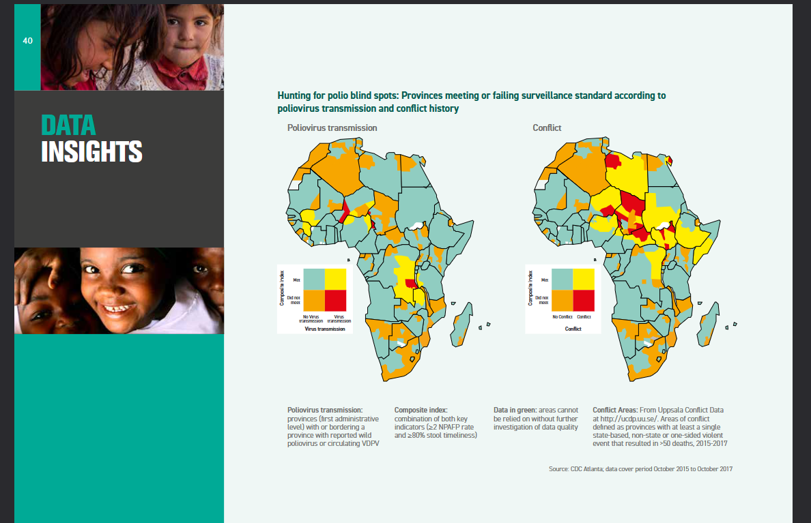
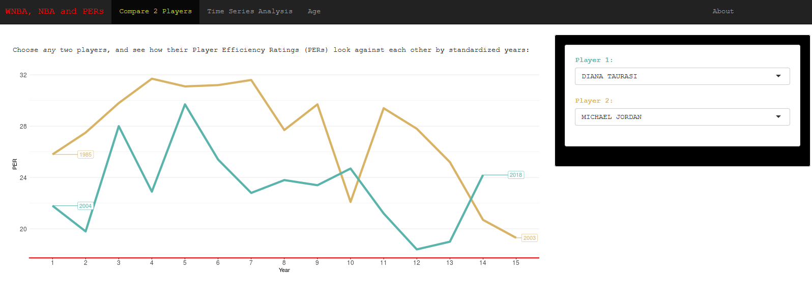

# Sara Khan — Data Analyst Portfolio

**Public Health · Clinical Analytics · Federal Contracting · R · SQL · Python**

  
  &nbsp;
  
  &nbsp;
  
  &nbsp;
  

---

## 👋 Welcome

Data analyst with 9+ years of experience in public health surveillance, federal contracting, and nonprofit analytics — building CDC pipelines that shaped WHO policy, teaching R at Emory and the CDC, and finding the story hidden in messy data.

- 🏥 **CDC Global Immunization Division** — Sr. Data Analyst (2016–2019)
- 🎓 **Emory Rollins School of Public Health** — Adjunct Instructor, Biostatistics
- 📊 **CDC R Users Group** — President & Trainer
- 🌐 **Dharma Relief** — Founding Operations Lead; $649K raised, 1.2M masks delivered to 173 hospitals

---

## 🛠️ Tech Stack

**Languages & Analysis**

**Data Engineering & Infrastructure**

ETL Pipelines &nbsp;·&nbsp;

**Visualization & Reporting**

**AI & Machine Learning**

NLP Pipelines &nbsp;·&nbsp; Anomaly Detection

---

## 📊 Project Portfolio

### 🦠 Global Polio Surveillance Pipeline

Production ETL pipeline for WHO/IMB across 79 countries. Invented a Spatial Binning method to fix a root data quality problem — one-size-fits-all metrics were hiding virus circulation in small provinces. Added 4 automated surveillance flags. Maintained on GitLab for 2 years. Published *Vaccine X* 2020.

**Tools:** R · SQL · WHO POLIS · WorldPop · GitLab &nbsp;|&nbsp; [Code](https://github.com/skhan890/surv_manuscript) · [Paper](https://www.ncbi.nlm.nih.gov/pmc/articles/PMC7090369/)

---

### 🏀 NBA × WNBA PER Dashboard

Interactive Shiny app comparing Player Efficiency Ratings across leagues. No public WNBA dataset existed — hand-scraped player data from Wikipedia + scripted Basketball-Reference.com. Presented at R-Ladies Atlanta × Atlanta Hawks.

**Tools:** R Shiny · ggplot2 · tidyverse · Web Scraping &nbsp;|&nbsp; [Code](https://github.com/skhan890/RLadies_Hawks) · [Demo](https://skhan22.shinyapps.io/RLadies_Hawks/)

---

### 💛 Donor Revenue Analysis — Chan Center

Integrated 3 disconnected data sources (Donorbox, Luma, Excel) in R. Deduplicated donor identities, tracked payment history and tenure across records. Finding: only ~100 active donors. Directly drove new registration policy + membership survey.

**Tools:** R · Data Integration · Excel

---

## 💼 Experience

| Role | Organization | Period |
|------|-------------|--------|
| Analytics & Operations Lead | Tallahassee Chan Center | Feb 2021 – Mar 2026 |
| Associate Consultant (Data Analyst) | Gorman Consulting / Gates Foundation | Oct 2019 – Sep 2021 |
| Research Scientist | University of Washington | May – Sep 2019 |
| Adjunct Faculty, Biostatistics | Emory University, Rollins SPH | Jan 2018 – Jan 2022 |
| Senior Data Analyst (Federal Contractor) | CDC, SciMetrika | Jun 2017 – May 2019 |
| Data Analyst (Federal Contractor) | CDC, Carter Consulting | Aug 2016 – Jun 2017 |
| Statistical Programmer | Alimera Sciences | Jul – Jan 2017 |
| Independent Data Analyst | ThoughtBridge · BNL Consulting · FAMU | 2019 – 2021 |

**Highlights:**
- Chaired **CDC R Users Group** (1,000+ members across HHS); coordinated first agency-wide R training with 130 enrollees spanning all CDC campuses
- Co-developed the **Zika Pregnancy Registry** database management system for national multi-site birth defect surveillance
- Modernized a legacy SAS pipeline for Zika surveillance into R + SQL Server; built longitudinal newborn growth analysis in R Shiny
- Conducted large-scale quantitative simulation modeling on ~800,000-entity network data for NIH R21 epidemiological modeling project (UW)
- Sole instructor for **BIOS 544: Introduction to R Programming** at Emory; lab instructor for biostatistics courses serving ~650 incoming MPH/MSPH students annually

---

## 📚 Publications & Awards

**Publications**

- VanderEnde KV, Voorman A, **Khan S**, Anand A, Snider C, Goel A, Wassilak S. New analytic approaches for analyzing and presenting polio surveillance data. *Vaccine X.* 2020. [[PMC7090369]](https://www.ncbi.nlm.nih.gov/pmc/articles/PMC7090369/)
- Lind JN, Interrante JD, Ailes EC, Gilboa SM, **Khan S** et al. Maternal Use of Opioids During Pregnancy and Congenital Malformations: A Systematic Review. *Pediatrics.* 139(6), 2017.
- Zaman K, Sack DA, Yunus M, **Khan S** et al. Immunogenicity of inactivated and live attenuated poliovirus vaccines in a birth cohort in Bangladesh. *Vaccine.* 2021.

**Awards & Certifications**

- 🏅 **2017 CDC Award for Science and Program Excellence in Emergency Response** — Domestic Zika Pregnancy and Birth Defects Surveillance
- 📋 **Excellence in Volunteer Management** — Florida Association for Volunteer Resource Management (FAVRM), 2025

---

## 🎓 Education

| Degree | Institution | Year |
|--------|-------------|------|
| **MSPH, Public Health Informatics** | Emory University, Rollins School of Public Health | 2016 |
| **BS, Public Health** *(cum laude)* | Rutgers University, Edward J. Bloustein School | 2014 |

Capstone: *Development of a Time Monitoring Application for Birth Defect Registries*

---

## 🎤 Speaking

| Talk | Venue | Year |
|------|-------|------|
| [Practicing Chan While Working](https://www.youtube.com/watch?v=st1kBrb7jKg) | Tallahassee Chan Center | 2023 |
| Sports Analytics & R Shiny | R-Ladies Atlanta × Atlanta Hawks | 2019 |
| NBA/WNBA PER Methodology | Emory Sports Analytics Team | 2019 |

---

## 🏆 Volunteer & Leadership

- **Dharma Relief — Founding Operations Lead** (2020–2026): Led COVID-19 PPE supply chain — raised **$649K in 7 weeks**, delivered **1.2 million masks** to 173 hospitals across North America; secured transportation grant
- **IRC Refugee Resettlement Volunteer** (2022–Present): Housing setup, tutoring, transportation, and community integration for refugee families

---

## 💡 Interests

Technology × mindfulness &nbsp;·&nbsp; AI side projects &nbsp;·&nbsp; video games &nbsp;·&nbsp; meditation &nbsp;·&nbsp; yoga &nbsp;·&nbsp; hiking

---

<<<<<<< HEAD
<<<<<<< HEAD
=======
=======
**📍 Tallahassee, FL &nbsp;|&nbsp; U.S. Citizen, eligible for security clearance**
>>>>>>> 201faea (more updates)

*⭐ Star a repo if it's useful · Questions? [by.sara.khan@gmail.com](mailto:by.sara.khan@gmail.com)*

>>>>>>> a68e2d0 (more updates)

